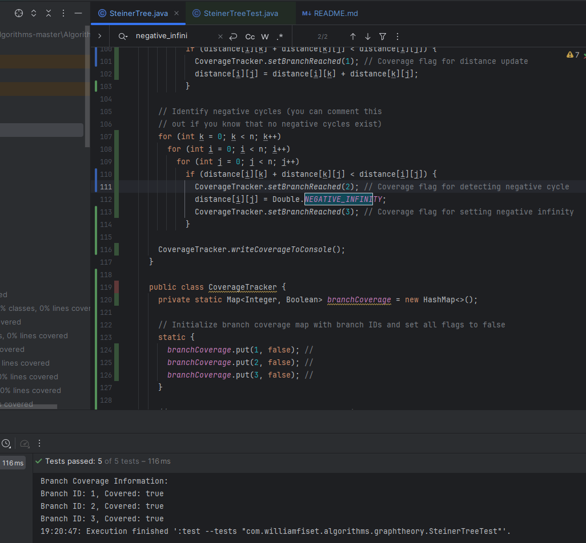

# Report for Assignment 1

## Project chosen

Name: williamfiset/Algorithms

URL: https://github.com/williamfiset/Algorithms

Number of lines of code and the tool used to count it: 31 kloc, lizard

Programming language: Java

## Coverage measurement

### Existing tool

The tool that was used was the built in Intellij Coverage tool. We used the tool on the entire tests folder.

<Show the coverage results provided by the existing tool with a screenshot>

# work by Michael Tedeev

### Your own coverage tool

Fuction name: push();

https://github.com/Te-Michael/Algorithms/commit/ae6de0d69f88bf22168d01f29e1e3aba0c443f8a
<Provide a screenshot of the coverage results output by the instrumentation>

Fuction name: floydWarshall();

https://github.com/Te-Michael/Algorithms/commit/95981628cbf280dfe113873be1c339e3bb7ea790

## Coverage improvement

### Individual tests

<The following is supposed to be repeated for each group member>

<Group member name>

testPush(); 

https://github.com/Te-Michael/Algorithms/commit/ae6de0d69f88bf22168d01f29e1e3aba0c443f8a

old coverage:

 
new coverage:

  
The reason the coverage was improved was due to the implementation of testPush for arrayStack. When the stack reached 16 it is supposed to double in capacity. However, nothing was testing that clause. The function testPush tests that case, and hence covers it. it goes from 2/3rds covered to 3/3rds covered
  

testNegativeCycle();  
https://github.com/Te-Michael/Algorithms/commit/95981628cbf280dfe113873be1c339e3bb7ea790
 
old coverage:

 
new coverage:

 
The coverage here was improved due to the implementation of testNegativeCycle(); In the source code, there is a special case if the MST-like datastructure has a negative cycle as that would invalidate the measurment. So my test covers that , whereas before it wasnt covered. The coverage goes from 1/3rd to 3/3rds

# work by Oliwer Dembicki
## Coverage measurement

### Your own coverage tool

<The following is supposed to be repeated for each group member>

<Group member name>

<Function 1 name>

<Show a patch (diff) or a link to a commit made in your forked repository that shows the instrumented code to gather coverage measurements>

<Provide a screenshot of the coverage results output by the instrumentation>

<Function 2 name>

<Provide the same kind of information provided for Function 1>

## Coverage improvement

### Individual tests

<The following is supposed to be repeated for each group member>

<Group member name>

<Test 1>

<Show a patch (diff) or a link to a commit made in your forked repository that shows the new/enhanced test>

<Provide a screenshot of the old coverage results (the same as you already showed above)>

<Provide a screenshot of the new coverage results>

<State the coverage improvement with a number and elaborate on why the coverage is improved>

<Test 2>

<Provide the same kind of information provided for Test 1>

# work by Alun Arkananta
## Coverage measurement

### Your own coverage tool

<The following is supposed to be repeated for each group member>

<Group member name>

<Function 1 name>

<Show a patch (diff) or a link to a commit made in your forked repository that shows the instrumented code to gather coverage measurements>

<Provide a screenshot of the coverage results output by the instrumentation>

<Function 2 name>

<Provide the same kind of information provided for Function 1>

## Coverage improvement

### Individual tests

<The following is supposed to be repeated for each group member>

<Group member name>

<Test 1>

<Show a patch (diff) or a link to a commit made in your forked repository that shows the new/enhanced test>

<Provide a screenshot of the old coverage results (the same as you already showed above)>

<Provide a screenshot of the new coverage results>

<State the coverage improvement with a number and elaborate on why the coverage is improved>

<Test 2>

<Provide the same kind of information provided for Test 1>

# work by Hugo Sokolowski-Katzer
## Coverage measurement

### Your own coverage tool

< The following is supposed to be repeated for each group member>

< Group member name>

<Function 1 name>

<Show a patch (diff) or a link to a commit made in your forked repository that shows the instrumented code to gather coverage measurements>

< Provide a screenshot of the coverage results output by the instrumentation>

<Function 2 name>

<Provide the same kind of information provided for Function 1>

## Coverage improvement

### Individual tests

< The following is supposed to be repeated for each group member>

< Group member name>

<Test 1>

<Show a patch (diff) or a link to a commit made in your forked repository that shows the new/enhanced test>

<Provide a screenshot of the old coverage results (the same as you already showed above)>

< Provide a screenshot of the new coverage results>

< State the coverage improvement with a number and elaborate on why the coverage is improved>

<Test 2>

<Provide the same kind of information provided for Test 1>

### Overall

<Provide a screenshot of the old coverage results by running an existing tool (the same as you already showed above)>

< Provide a screenshot of the new coverage results by running the existing tool using all test modifications made by the group>

## Statement of individual contributions

< describe what each group member did>

